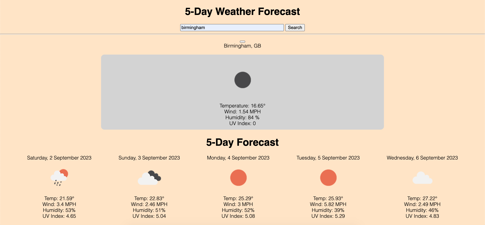

# weather-dashboard

This project was to build an application for displaying the weather of a user searched location.

Using the OpenWeather API was quite a challenge initially, but after getting used to the syntax and using Web APIs more frequently, I found that it was quite easy to use.

I have not managed to get the local storage working but I would like to fix this at a later stage - the data is recorded into local storage but does not create button elements as it should.

I had some help during tutor sessions to help with the local storage issue.

One particularily challenging aspect about this project was implementing icons. yuvraaaj on GitHub provided some very helpful files and a step-by-step tutorial which I used to help get this implemented: https://github.com/yuvraaaj/openweathermap-api-icons

The deployed code is accessible here: https://github.com/dylanadams98/weather-dashboard

The deployed page is accessible here: https://dylanadams98.github.io/weather-dashboard

